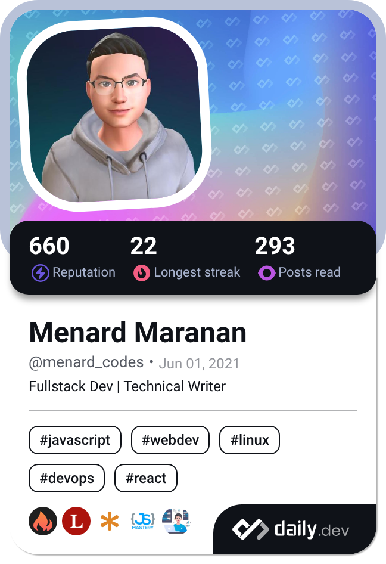

<hgroup>
	<h1>Menard Maranan 👨‍💻</h1>
	
3+ years Fullstack Developer

</hgroup>

<h3>Personal Links</h3>

<!--  -->

<!--  -->

### Github

	
	

<!-- 

	

 -->

	

## Overview

- 📫 How to reach me: ✉️ **menardmaranan16@gmail.com**

- 📄 My LinkedIn is here [Menard Maranan - Linked In Profile](https://www.linkedin.com/in/menard-maranan/)

<!-- - 🔭 I’m currently working on: **My Start-up.** -->

- 🌱 I’m currently learning **System Design**

- 👯 I’m looking to collaborate on **open source projects**

<!-- - 👨‍💻 My portfolio is in [https://menard-maranan.codes](https://menard-maranan.codes) -->

- 📝 I write articles in [https://dev.to/menard_codes](https://dev.to/menard_codes)

<!-- - 💬 Ping me regarding: **Open source contribution, hackathon, a fullstack dev job opportunity, or a tech writing job** -->

## 🏆 Highlights

- 🥇 **Dev.to Hackathon Winner** — [Solar System: Glam Up My Markup](https://dev.to/menard_codes) (Sept 2024)
- 👨‍💻 **Hackathon Project** - [Secure File Transfer](https://github.com/menard-codes/secure-file-transfer)
    - **Hackathon Entry**: https://dev.to/menard_codes/secure-file-transfer-a-safer-way-to-share-sensitive-files-online-2nnj
- 🛍️ **Shipped a Production (End-to-End) Shopify App**
	- 🔗 [Syncor Alt on the Shopify App Store](https://apps.shopify.com/syncor-alt)
	- 🔗 [Website](https://syncor-alt.com)

## Skills

### Frontend

### Backend

### Databases & Caching

### DevOps & Tools

